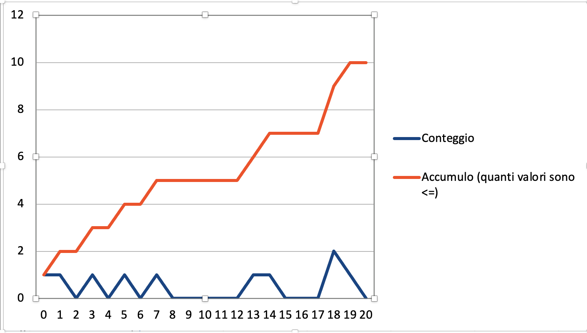
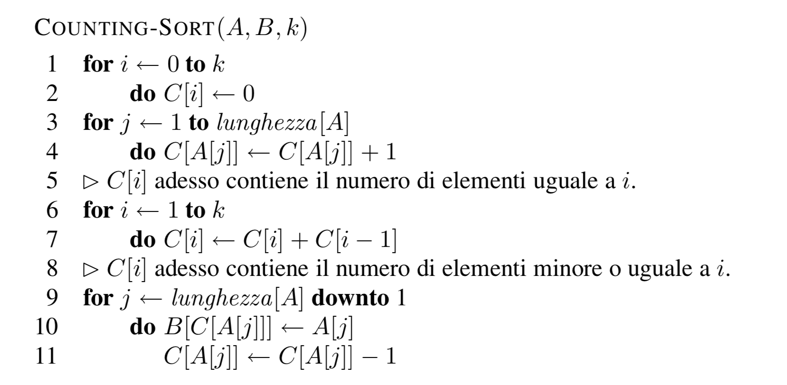
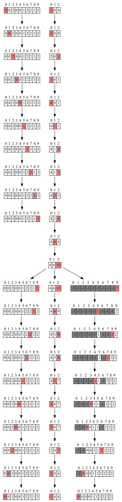

# Counting Sort

Contare quante occorrenze ci sono in un array dato.

La complessità spaziale: O(n+k) = O(n+n^2)

Complessità tempo: O(n)

Dove n è la dimensione dell'array e k è il massimo valore che ci può essere (nell'array).

## Come funziona il counting sort?

Possiamo **contare quanti elementi minori** o uguali a uno specifico valore.
L'algoritmo conta il numero di occorrenze di ciascun valore presente nell'array da ordinare, memorizzando questa informazione in un array temporaneo di dimensione pari all'intervallo di valori. Il numero di ripetizioni dei valori inferiori indica la posizione del valore immediatamente successivo.



Sorting globale, senza una comparazione

Algoritmo linearmente dipendente dal valore massimo presente nell'array, con valori molto piccoli è estremamente efficiente, ma basta anche sotalto un elemento molto elevato per dover allocare una grande quantità di memoria

Come essere indipendenti da k e dipendenti da n?



* Array C è quello di accumolo e di conteggio (in tempi diversi)
* A è l'array che si sta analizzando

L'array finale verrà riempito secondo l'ordine di posizione dell'attay iniziale, non ci sarà una scrittura lineare.

Da pseudo codice a C++
```cpp
void counting_sort(int* A, int* B, int* C, int n, int k) {
  /// A: array in input 0..n-1
  /// B: array in output 0..n-1
  /// C: array per conteggi 0..k
  /// n: elementi da ordinare
  /// k: valore massimo contenuto in A

  for (int i=0;i<=k;i++){ /// reset array conteggi
    C[i]=0;
    ct_opw++;
  }

  for (int j=0;j<n;j++){ /// conteggio istogramma
    C[A[j]]++;
    ct_opr++;
    ct_opr++;
    ct_opw++;
  }

  if (details){
    printf("array conteggi\n");
    print_array(C,k+1);
  }
  for (int i=1;i<=k;i++){ /// C[i] contiene il numero di elementi <= i
    C[i]+=C[i-1];
    ct_opr++;
    ct_opr++;
    ct_opw++;
  }
  
  if (details){
    printf("array con conteggi accumulati\n");
    print_array(C,k+1);
  }
  
  for (int j=n-1;j>=0;j--){ /// per ogni elemento originale in A ->
                            /// mi chiedo nel conteggio C quanti sono gli elementi minori o uguali:
                            /// questo corrisponde alla posizione dell'elemento in B
    if (details)
      printf("A[%d]=%d, C[A[%d]]=%d --> scrivo B[%d-1]=%d\n",j,A[j],j,C[A[j]],C[A[j]],A[j]);
    
    B[C[A[j]]-1]=A[j];
    ct_opr++;
    ct_opr++;
    ct_opr++;
    ct_opw++;
    C[A[j]]=C[A[j]]-1;
    ct_opr++;
    ct_opr++;
    ct_opr++;
    ct_opw++;
  }

  if (details){
    printf("array con conteggi accumulati dopo il decremento\n");
    print_array(C,k+1);
  }

}
```


Grafo tramite dot

