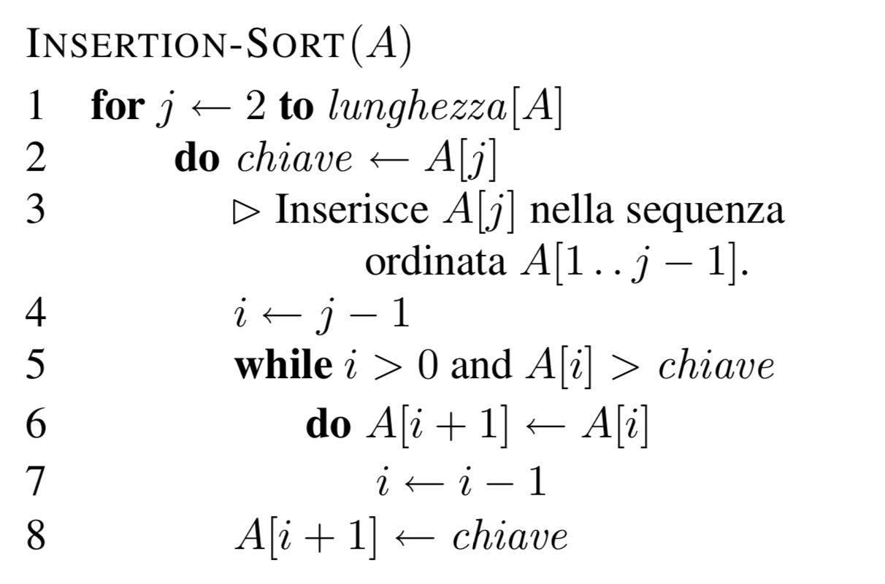

# Insertion Sorting

Pseudo codice



Insertion Sort: 
* Caso Peggiore: O(n^2)
* Caso Medio: O(n^2)
* Caso Migliore: O(1)

L'invariante di un algoritmo è una proprietà che è sempre vera per tutta l'esecusione di quest'ultimo, per esempio una porzione del gruppo degli elementi che devo ordinare sia già ormdinato.

```c
void insertion_sort(int* A, int n) {
  int i,j;
  for (i=0; i<n; i++) {
    for (j=i-1; j>=0; j--) {
      if (A[j]>A[j+1]) {
	swap (&A[j],&A[j+1]);
      } else {
	break;
      }
    }    
  }
}


// Swap

void swap(int* a, int* b){
  int tmp = *a;
  *a = *b;
  *b = tmp;
}
```

Questo metodo di ordinamento è molto simile a quello che le persone fanno quando devono ordinare delle carte e infatti dato che si tratta di un algoritmo in place (di trasformare una struttura dati utilizzando soltanto un piccolo e costante spazio di memoria extra) può essere utilizzato con soltanto 2 mani.

L'algoritmo divide in 2 parti il il campione di oggetti da ordinare e inizialmente il sotto campione di oggetti che sono già stati ordinati sarà composto da soltanto 1 elemento.
Quindi si prende l'elemento successivo non ordinato della sequenza e si comparerà quest'ultimo con il primo elemento della sequenza ordinata. 
Se il primo elemento è maggiore si confronta l'elemento da ordinare con quello successivo del sotto campione già ordinato e così via finchè non si arriva ad un punto in cui o si trova un elemento minore (elemento da ordinare < elemento della sequenza già oridnata) oppure si arriva alla fine della sequenza "ordinata".
Arrivati a ciò si posizionerà l'elemento da ordinare prima di quello minore nella sequenza ordinata oppure al termine della sequenza se non ci sono elementi inferiori.

```cpp
L'input e':
10 9 8 7 6 5 4 3 2 1 
passo 0:
10 9 8 7 6 5 4 3 2 1 
passo 1:
9 10 8 7 6 5 4 3 2 1 
passo 2:
8 9 10 7 6 5 4 3 2 1 
passo 3:
7 8 9 10 6 5 4 3 2 1 
passo 4:
6 7 8 9 10 5 4 3 2 1 
passo 5:
5 6 7 8 9 10 4 3 2 1 
passo 6:
4 5 6 7 8 9 10 3 2 1 
passo 7:
3 4 5 6 7 8 9 10 2 1 
passo 8:
2 3 4 5 6 7 8 9 10 1 
passo 9:
1 2 3 4 5 6 7 8 9 10 
L'output e':
1 2 3 4 5 6 7 8 9 10
```

Numero di Swap = n*(n+1)/2

 > Se si prende un Array parzialmente ordinato è un algoritmo molto efficiente

 