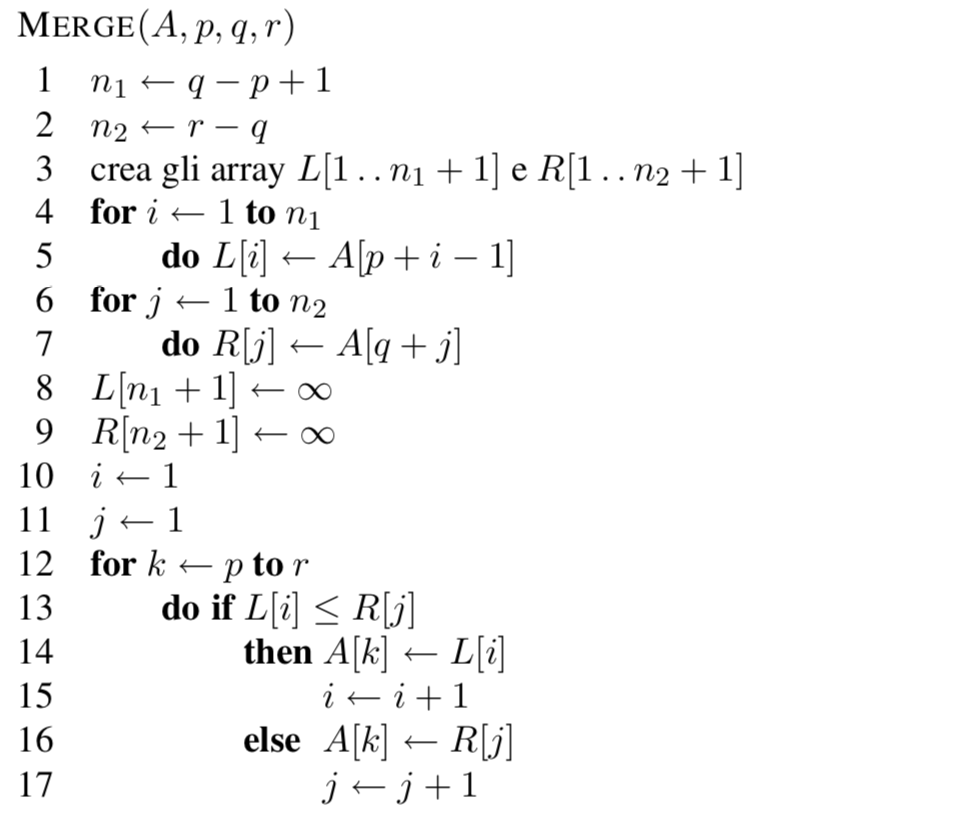

# Merge Sort
Figura 1


Figura 2



Merge Sort: 
* Caso Peggiore: O(n*log(n))
* Caso Medio: O(n*log(n))
* Caso Migliore: O(n*log(n))

Minimo e Massimo coincidono con la media, idipendentemente dai valori degli array i confronti che farò saranno sempre gli stessi.

Non solo è O grande, ma anche Omega (n*log(n)), questo algoritmo è schiacciato tra nlogn nel caso migliore e peggiore.


il Merge è linearmente dipendente rispetto alla dimensione dell'insieme che bisogna ordinare

Nel Merge sort identifico 2 zone su cui lavorare e ricorsivamente verrà chiamato la funzione Merge_Sort su entrambe le zone, quando si arriva a una dimensione di 1, si fa una sola operazione di confronto e si ritorna alla funzione chiamante (in cui verrà effettuato il merge).

## Concettualmente, l'algoritmo funziona nel seguente modo:

Se la sequenza da ordinare ha lunghezza 0 oppure 1, è già ordinata. Altrimenti:
* La sequenza viene divisa (divide) in due metà (se la sequenza contiene un numero dispari di elementi, viene divisa in due sottosequenze di cui la prima ha un elemento in più della seconda)
* Ognuna di queste sottosequenze viene ordinata, applicando ricorsivamente l'algoritmo (impera)
* Le due sottosequenze ordinate vengono fuse (combina). Per fare questo, si estrae ripetutamente il minimo delle due sottosequenze e lo si pone nella sequenza in uscita, che risulterà ordinata.

## Funzione Merge_Sort

```cpp
void merge_sort(int* A, int p, int r, int* L, int* R) {
  /// gli array L e R sono utilizzati come appoggio per copiare i valori: evita le allocazioni nella fase di merge
  if (p<r){
    int q=(p+r)/2;
    merge_sort(A,p,q,L,R);
    merge_sort(A,q+1,r,L,R);
    merge(A,p,q,r,L,R);
    if (details)
      print_array(A,n);

  }
}
```

## Funzione Merge
```cpp
void merge(int* A, int p, int q, int r, int* L, int* R){

  /// copia valori delle due meta p..q e q+1..r
  int i=0;
  int j=0;
  int k=0;
  
  for (i=0;i<q-p+1;i++)
    L[i]=A[p + i];
  L[i]=1000000; /// un numero grande
  
  for (i=0;i<r-q;i++)
    R[i]=A[q+1 + i];
  R[i]=1000000; /// un numero grande


  //// dettagli
  if (details){
    printf("Array L (%d .. %d): ",p,q);
    print_array(L,q-p+1);
    printf("Array R (%d .. %d): ",q+1,r);
    print_array(R,r-q);   
  }

  
  i=0; /// usato per gestire array L
  j=0; /// usato per gestire array R

  for (k=p;k<=r;k++){
    ct_cmp++;
    if (L[i]<=R[j]){
      A[k]=L[i];
      i++;
    }
    else{
      A[k]=R[j];
      j++;
    }
  }
  
}
```

