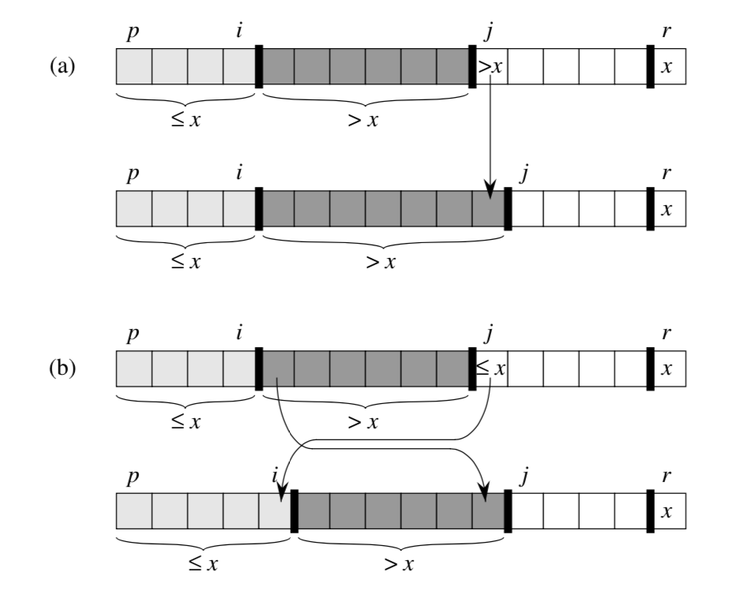
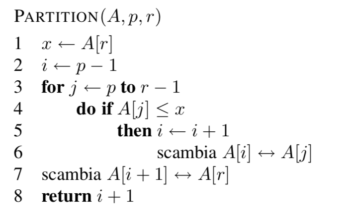
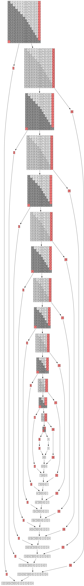
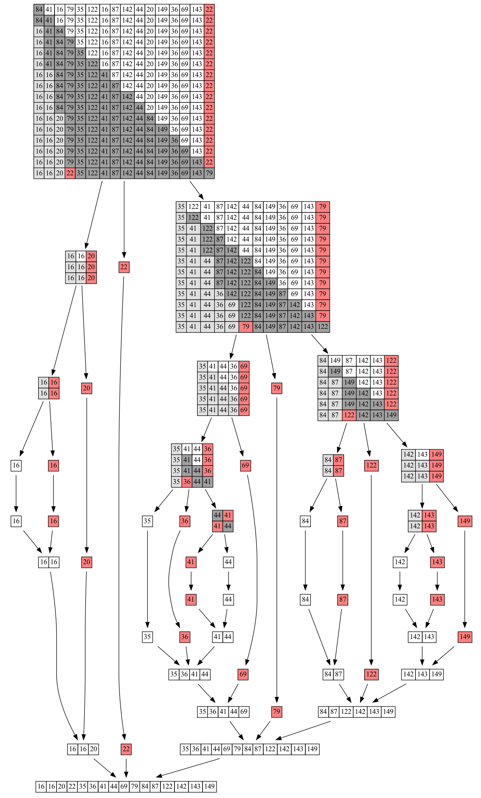

# Quick Sort

Algoritmo a confronti e ricorsivo


Partition è la chiave di quick sort.

Partition restituirà un valore tramite cui divideremo l'array. Il punto di divisione dell'array dipenderà dai nostri dati.

Partition costo O(n) e dato che siamo in un algoritmo dividi et impera (divide e conquista), il costo totale sarà O(n*log(n))

Costo Quick Sort
- Caso Peggiore: O(n^2)
- Caso Medio: O(n*log(n))


## Partition



Con partition divido l'array in 2 parti, una parte con elementi minori di pivot e una parte con elementi maggiori di pivot.



Traduzione in C++

```cpp
int partition(int* A, int p, int r){

  /// copia valori delle due meta p..q e q+1..r
  ct_read++;
  int x=A[r];
  int i=p-1;
  
  for (int j=p;j<r;j++){
    if (A[j]<=x){
      i++;
      swap(A[i],A[j]);
    }    
  }
  swap(A[i+1],A[r]);

  return i+1;
}
```

Quick Sort con la chiamata ricorsiva 

```cpp
void quick_sort(int* A, int p, int r) {
  /// gli array L e R sono utilizzati come appoggio per copiare i valori: evita le allocazioni nella fase di merge
  if (p<r) {
    int q= partition(A,p,r);
    quick_sort(A,p,q-1);
    quick_sort(A,q+1,r);
  }
}

```

La chiamata ricorsiva esclude sempre il pivot

Caso pessimo:



Caso medio:



