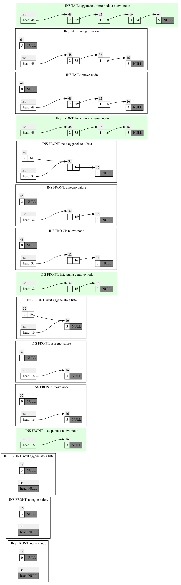

# Liste
In informatica, una Lista (List) è una struttura dati astratta e dinamica (la memoria usata non è necessariamente fisicamente contigua) che denota una collezione omogenea o container di dati. L'accesso a un elemento della struttura avviene direttamente solo al primo elemento della sequenza; per accedere a un qualunque elemento, occorre scandire sequenzialmente tutti gli elementi che lo precedono; è una struttura dati dinamica poiché può cambiare di dimensione grazie alle operazioni di inserimento ed eliminazione di elementi, diversamente al caso degli array standard.


Elemento della lista:
* Dato
* Riferimento al prossimo elemento della lista

Il riferimento in C è un puntatore.

Inseriemnto in testa O(1)

Inseriemnto in coda O(n)

Cancellazione in testa O(1)

Cancellazione della coda O(n)

```cpp
typedef struct node {
    int val;
    struct node * next;
} node_t;


/// struct per la lista
typedef struct list {
     node *head;
  // node* tail;
  /// per lista doubly linked
} list_t;
```
Guardare i metodi in "list.c"


grafi delle liste:

```cpp
  list_insert_front(list,3);
  list_insert_front(list,1);
  list_insert_front(list,2);
  list_insert_tail(list,5);
```
(guardare dal basso verso l'alto)



