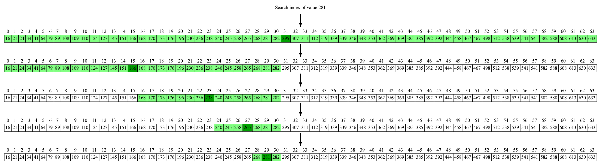

# Ricerca per bisezione

I dati possono essere inseriti in strutture più o meno efficienti nel permettere di trovare
una specifica chiave.

Noi useremo un array, se l'elemento esiste (anche più istanze) qual è la complessità computazionale nella ricerca dell'elemento? 

## Array non ordinato

Costo cercare oggetto:
* Pessima : Lineare O(n)
* Media : Lineare O(n)
* Ottimale : costante O(1)

Preprocessing:
* O(1)

**Ricerca totale**: 
- 1 Ricerca O(1)+O(n) => O(n)
- K Ricerche O(1)+k x O(n) => O(n x k) => O(n^2)

## Array ordinato
E se facessi un preprocessing del mio array ?

Effettuo un sorting dell'array con un algoritmo generico n log(n).

Ricerca in caso di bisezione? 

* Pessima :  O(log n)
* Media :  O(log n)
* Ottimale :  O(1)

**Ricerca totale**: 
- 1 Ricerca O(1n logn)+O(log n) => O(n log n)
- K Ricerche O(n log n)+O(k log n) => O(n log n)+O(k log n) => O(n log n)

# Implementazione 


Da pseudo codice a codice:

```cpp
int bisection(int* A, int n, int t){
  int l = 0 ;
  int r = n-1 ;
  while (l<=r){
  ct_op++;
  int m= (l + r)/2;
  if (details)
    printf("[%d .. %d .. %d]\n",l,m,r);
    if (A[m]<t) l= m+1;
    else{
      if (A[m]>t) r= m-1;
      else
	return m; /// trovato
    }
  }
  return -1; // non trovato
}
```

## Grafico



